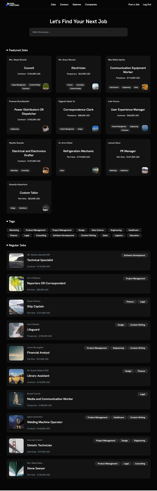

# Pixel Positions

Pixel Positions is a web application built with Laravel that allows users to post and find jobs. It includes features for job posting, job searching, user authentication, and email notifications for new job postings.



## Table of Contents

-   [Installation](#installation)
-   [Usage](#usage)
-   [Testing](#testing)
-   [Credits](#credits)

## Installation

### Prerequisites

-   PHP >= 8.0
-   Composer
-   Node.js & NPM
-   A database (e.g., MySQL, PostgreSQL, SQLite)

### Setup

1. Clone the repository:

    ```sh
    git clone https://github.com/edriso/pixel-positions.git
    cd pixel-positions
    ```

2. Install PHP dependencies:

    ```sh
    composer install
    ```

3. Install JavaScript dependencies:

    ```sh
    npm install
    ```

4. Copy the example environment file and modify the configuration:

    ```sh
    cp .env.example .env
    ```

5. Generate an application key:

    ```sh
    php artisan key:generate
    ```

6. Configure your database settings in the `.env` file.

7. Run database migrations and seed the database:

    ```sh
    php artisan migrate --seed
    ```

8. Build the front-end assets:

    ```sh
    npm run build
    ```

## Usage

### Running the Application

1. Start the local development server:

    ```sh
    php artisan serve
    ```

2. In another terminal, run the Vite development server:

    ```sh
    npm run dev
    ```

3. Open your browser and navigate to `http://localhost:8000`.

### Features

-   User registration and authentication
-   Job posting and listing
-   Job searching and filtering
-   Tagging system for jobs
-   Email notifications for new job postings

### Job Posting

Users can create job postings by navigating to the job creation form. Once a job is posted, an email notification is sent to the employer.

## Testing

To run some of job tests, use the following command:

```sh
php artisan test
```

## Credits

This project is based on the [30 Days to Learn Laravel 11](https://laracasts.com/series/30-days-to-learn-laravel-11) series by Laracasts.
